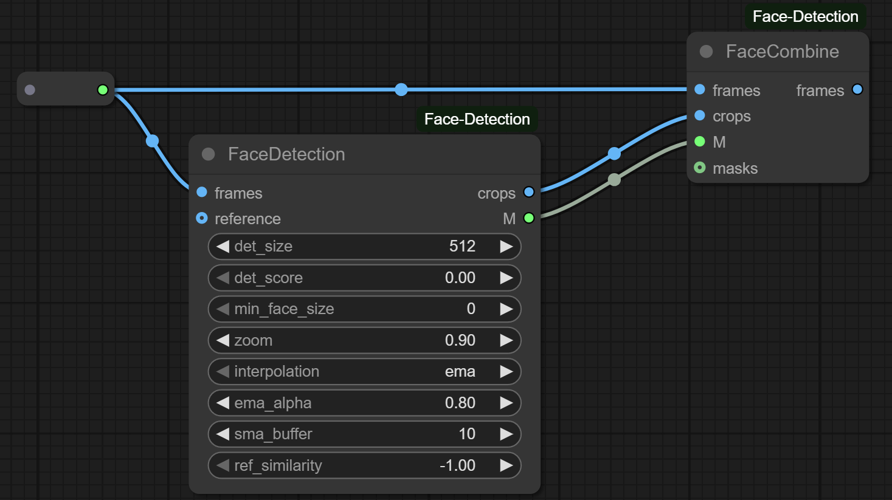

# ComfyUI Face Detection

> ⚠️ This requires [InsightFace](https://github.com/deepinsight/insightface) to be installed [[installation guide](#insightface-installation-guide)]

## Nodes

### FaceDetection

* **Inputs:**

  * `frames`: Batch of input RGB images.
  * `det_size`: Output crop size of the aligned face (e.g. 512×512).
  * `det_score`: Minimum face detection confidence threshold.
  * `min_face_size`: Minimum pixel height of a face to consider.
  * `zoom`: Scale factor applied during face alignment.
  * `interpolation`: Landmark smoothing method (`"ema"` or `"sma"`).
  * `ema_alpha`: Smoothing strength for exponential moving average.
  * `sma_buffer`: Number of past frames to average in simple moving average.
  * `ref_similarity`: Minimum cosine similarity with reference embedding to accept a match.
  * `reference` *(optional)*: Reference image(s) to guide identity-specific face matching.

* **Output:**

  * `crops`: Tensor of aligned and cropped face images.
  * `M`: List of affine transformation matrices used for cropping.

### FaceCombine

* **Inputs:**

  * `frames`: Original image frames to blend faces into.
  * `crops`: Cropped and aligned face images to insert back.
  * `M`: Transformation matrices used to inverse-map the crops.
  * `masks` *(optional)*: Optional alpha masks for smooth blending.

* **Output:**

  * `frames`: Final combined image frames.

---

### Insightface Installation Guide 
**(*guide from [here](https://github.com/cubiq/ComfyUI_IPAdapter_plus/issues/162#issuecomment-1868967714))**
- Step 1: Check Python Version
  - From the root folder **(eg. ComfyUI Portable)** run CMD and type: `python_embeded\python.exe -V`
- Step 2: Download Appropriate Prebuilt Package ([source](https://github.com/Gourieff/Assets/tree/main/Insightface))
  - Download prebuilt Insightface package for your python version: 
  [**Python 3.9**](https://github.com/Gourieff/Assets/blob/main/Insightface/insightface-0.7.3-cp39-cp39-win_amd64.whl) or 
  [**Python 3.10**](https://github.com/Gourieff/Assets/blob/main/Insightface/insightface-0.7.3-cp310-cp310-win_amd64.whl) or 
  [**Python 3.11**](https://github.com/Gourieff/Assets/blob/main/Insightface/insightface-0.7.3-cp311-cp311-win_amd64.whl) or 
  [**Python 3.12**](https://github.com/Gourieff/Assets/blob/main/Insightface/insightface-0.7.3-cp312-cp312-win_amd64.whl) or 
  [**Python 3.13**](https://github.com/Gourieff/Assets/blob/main/Insightface/insightface-0.7.3-cp313-cp313-win_amd64.whl)
  - Put the downloaded package into the root folder

- Step 3: Install InsightFace
  - From the root folder run CMD
  - Update your PIP `python_embeded\python.exe -m pip install -U pip`
  - Then install Insightface:
    - For Python 3.9: `python_embeded\python.exe -m pip install insightface-0.7.3-cp39-cp39-win_amd64.whl`
    - For Python 3.10: `python_embeded\python.exe -m pip install insightface-0.7.3-cp310-cp310-win_amd64.whl`
    - For Python 3.11: `python_embeded\python.exe -m pip install insightface-0.7.3-cp311-cp311-win_amd64.whl`
    - For Python 3.12: `python_embeded\python.exe -m pip install insightface-0.7.3-cp312-cp312-win_amd64.whl`
    - For Python 3.13: `python_embeded\python.exe -m pip install insightface-0.7.3-cp313-cp313-win_amd64.whl`
